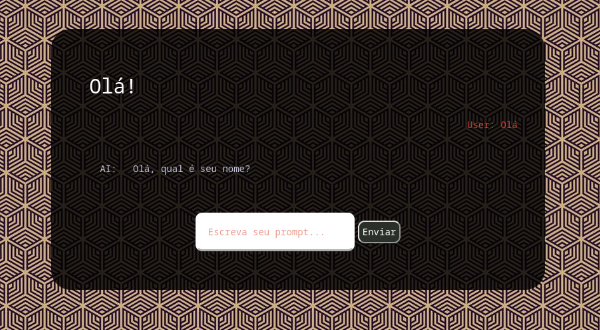
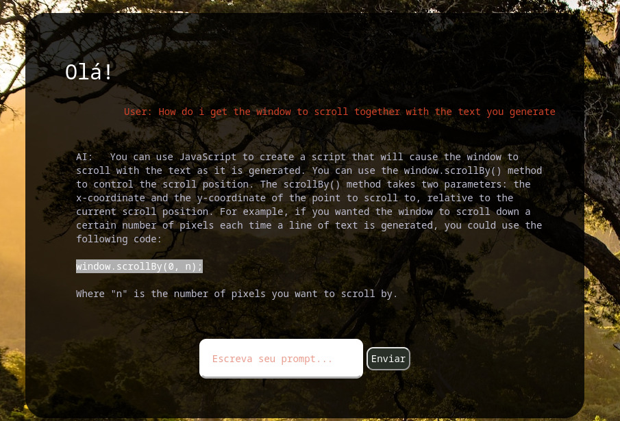

# Django Chatbot Project

This is a project that demonstrates the usage of Django as a front-end to interact with the Chatbot API powered by OpenAI's GPT-3.5 language model. The project allows users to enter prompts and receive responses from the Chatbot, powered by the GPT-3.5 model, through a web interface built using Django.

## Features

- User-friendly web interface for interacting with the Chatbot
- Input prompt submission and response display in real-time
- Integration with OpenAI's GPT-3.5 language model for generating responses
- Support for handling user input and displaying bot responses dynamically
- Ability to handle multiple user interactions and prompts sequentially

## Images

## Technologies Used

- Django: A powerful Python web framework for building web applications.
- OpenAI GPT-3.5: A state-of-the-art language model capable of generating human-like text responses.
- JavaScript: Used for handling user interactions and making API requests from the front-end.
- HTML/CSS: Used for creating the web interface and styling the chatbot.

## Installation

1. Clone the repository to your local machine.
2. Create a virtual environment and activate it.
3. Install the dependencies using `pip` by running `pip install -r requirements.txt`.
4. Set up your OpenAI API credentials by adding them to your environment variables or in the `settings.py` file.
5. Start the Django development server by running `python manage.py runserver`.
6. Access the chatbot web interface in your web browser at `http://localhost:8000` (or the appropriate URL based on your Django settings).

## Usage

1. Enter a prompt in the input field and click the "Enviar" button to send it to the Chatbot.
2. The Chatbot will generate a response based on the input prompt using the GPT-3.5 model.
3. The response will be displayed in the chatbot interface in real-time.
4. You can continue to enter new prompts and receive responses from the Chatbot as desired.
5. If there are any API failures or errors, appropriate messages will be displayed to the user.

## Contributing

If you would like to contribute to this project, feel free to fork the repository, make your changes, and submit a pull request. Contributions are welcome and appreciated!

## License

This project is licensed under the [MIT License](LICENSE).

## Acknowledgements

- This project was inspired by the capabilities of OpenAI's GPT-3.5 language model.
- Special thanks to the Django community for providing a powerful and flexible web framework for Python developers.
- Thanks to the team at OpenAI for their amazing work on developing advanced language models.
